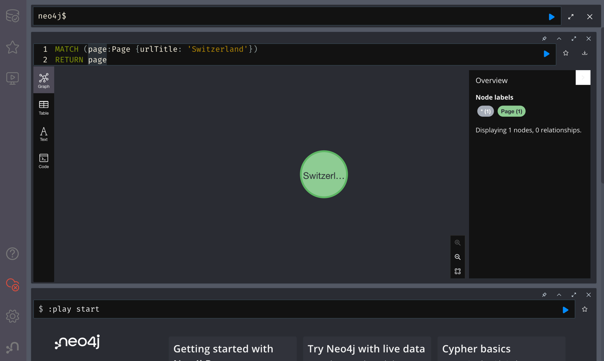

# Wiki Neo4j Starter

Dieses Projekt beinhaltet Skripte zum Einrichten und Verwalten von Neo4j sowie drei Starter-Applikationen. Ihr habt die
Möglichkeit, das gewünschte Wikipedia zu importieren.

## Setup

Wählt entweder https://en.wikipedia.org/ (benötigt ca. 20 GB Speicherplatz) oder die leichtgewichtigere
Version https://simple.wikipedia.org/ (benötigt ca. 2 GB Speicherplatz). Die ZIP-Dateien mit den Wikipedia-Daten werden
vom Lehrer bereitgestellt.

Entpackt die gewählte Datei im Verzeichnis ~/wikidata/, sodass die CSV-Dateien unter ~/wikidata/en_wiki/ bzw. ~
/wikidata/simple_wiki/ zu finden sind.

Für das Setup gibt es für beide Wikis separate Ordner: neo4j-en-wiki und neo4j-simple-wiki. Nachdem ihr die CSV-Dateien
am richtigen Ort entpackt habt, navigiert zum gewünschten Ordner und befolgt die Anweisungen im README.md, um das Setup
durchzuführen und Neo4j zu starten oder zu stoppen.

## Web GUI

Nachdem ihr das gewünschte Wiki importiert habt, könnt ihr das Admin GUI lokal unter http://localhost:7474/ öffnen. Dort
werdet ihr mit einem Anmeldebildschirm begrüßt. Wählt einfach "no authentication" aus. Anschließend könnt ihr euren
ersten Cypher-Query testen. Verwendet zum Beispiel:

```cypher
MATCH (page:Page {urlTitle: 'Switzerland'})
RETURN page
```

Ihr solltet anschließend folgendes Resultat sehen:



## Indizes

Da unsere Suchen meist über das 'urlTitle'-Attribut laufen, können wir einen Index darüber erstellen. Dies wird die
Abfragen erheblich beschleunigen. Führt dazu lediglich folgendes Query im Admin GUI aus (Das Anlegen des Indexes kann
eine Weile dauern):

```cypher
CREATE CONSTRAINT pages_urlTitle
FOR (p:Page) REQUIRE p.urlTitle IS UNIQUE
```
